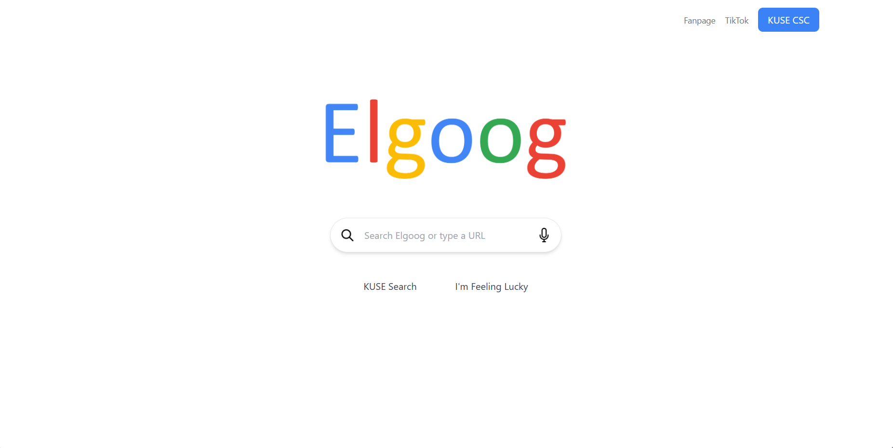
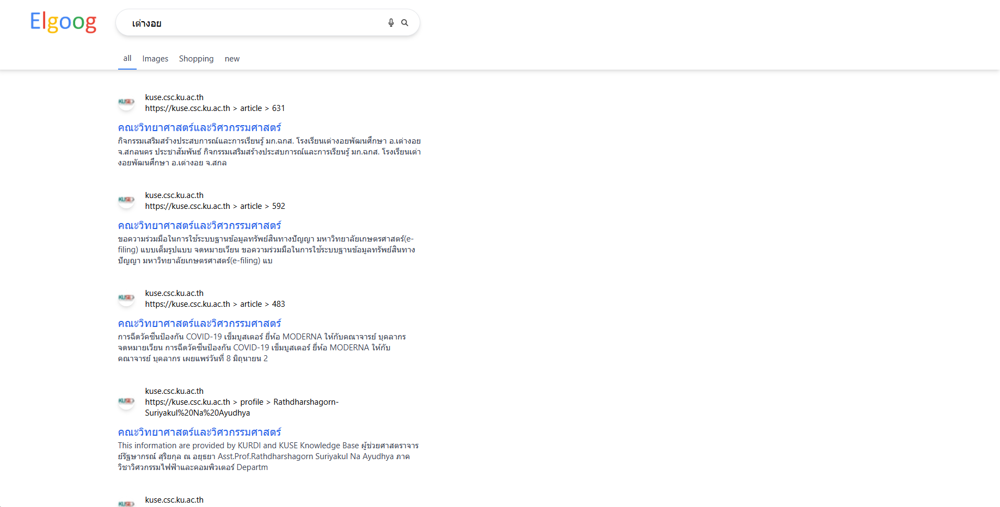

# Elgoog
## Google Clone for KUSE Search Engine

Elgoog is a simple clone of Google designed specifically for the KUSE search engine.
This project uses React.JS for GUI and use Django for the api, so you can download that api repository in my GitHub

### Deployment
https://elgoog.onrender.com/

## Previews

### Index

### Search Result
